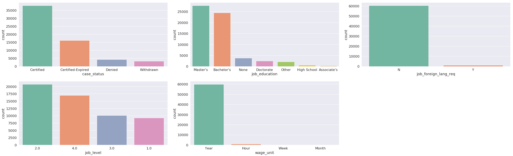
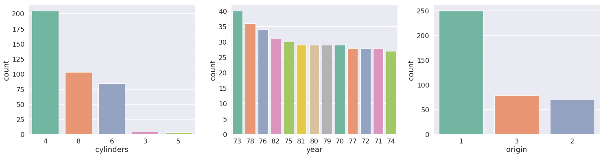
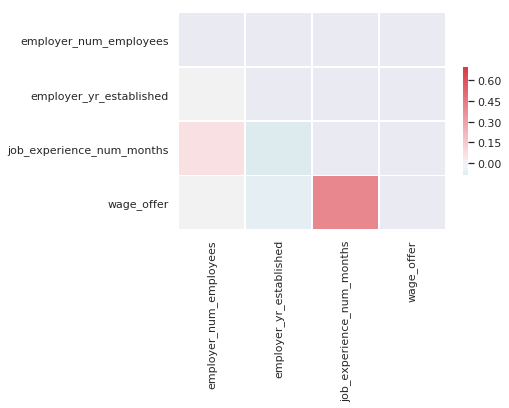

# dstools
A toolkit to help with everyday data science tasks. 

### Examples


* Seperating categorical, continuous and date features. Optionally apply type changes.
* Flag features with high correlation, low variance etc. 
* Plotting - generate distribution plots, flag skew
* Generate learning curves, threshold optimization
* Generate feature importance graphs

### Code Snippets

```python
from dstools.dstools import DStools as dst
```


```python
data =  pd.read_csv("./sample_dataset/wages_data_iso8859.csv", encoding='ISO-8859-1')
ds = dst()
```

* Data types from CSV before processing 


```python
data.dtypes
```

    case_number                   object
    case_received_date            object
    decision_date                 object
    case_status                   object
    employer_name                 object
    employer_num_employees       float64
    employer_yr_established      float64
    job_education                 object
    job_experience_num_months    float64
    job_state                     object
    job_foreign_lang_req          object
    job_level                    float64
    employee_citizenship          object
    wage_offer                   float64
    wage_unit                     object
    dtype: object


* Seperating numerical/categorical/temporal features and applying datatypes to dataframe


<br>
process_dtypes options 
<br>
 - tapply to selectively transform datatypes
<br>
 - thr acts as a threshold beyond which a feature is considered numerical
<br>
 - for example if a feature has 2000 unique categories it could be transformed to encoded to numeric
 <br>


```python
features = ds.process_dtypes(data, tapply = True, thr=30)
```

    feature  employer_name  contains  17985  unique values, converted to numeric encoding
    feature  job_state  contains  57  unique values, converted to numeric encoding
    feature  job_level  contains  4  unique values, converted to categorical encoding
    feature  employee_citizenship  contains  176  unique values, converted to numeric encoding


* Data types from CSV after processing 
<br>
-Notice datetime and category updates to fetures


```python
data.dtypes
```

    case_number                          object
    case_received_date           datetime64[ns]
    decision_date                datetime64[ns]
    case_status                        category
    employer_name                         int16
    employer_num_employees              float64
    employer_yr_established             float64
    job_education                      category
    job_experience_num_months           float64
    job_state                              int8
    job_foreign_lang_req               category
    job_level                          category
    employee_citizenship                  int16
    wage_offer                          float64
    wage_unit                          category
    dtype: object


Process dtype returns a dictionary of features, keyed according to their type. 
 - skip: feature that has vary low variance, such as index columns etc
 - encode: features that do not fit well in numercal due to low number of unique values and should be encoded
 - dtfeatures: temporal features such as date 


```python
features
```
    defaultdict(list,
                {'skip': ['case_number'],
                 'dtfeatures': ['case_received_date', 'decision_date'],
                 'catfeatures': ['case_status',
                  'job_education',
                  'job_foreign_lang_req',
                  'job_level',
                  'wage_unit'],
                 'encode': ['employer_name', 'job_state', 'employee_citizenship'],
                 'numfeatures': ['employer_num_employees',
                  'employer_yr_established',
                  'job_experience_num_months',
                  'wage_offer']})


To analyze a range of continuous features at a glance, the dist_plots method can be used. It generates density plots(green) along with approximated distribution (red) for a given feature


```python
ds.dist_plots(data, features.get('numfeatures'), scale=True)
```


Similarly for categorical features, count plots can be generated for a list of features (the features dictionary generated above comes in handy here). Optionally, a xhue option can be passed to generate count plots that consider another categorical feature.


```python
ds.count_plots(data, features.get('catfeatures'))
```





```python
ds.count_plots(data, features.get('catfeatures').copy(), xhue="job_level")
```





* A Quick way to find out highly correlated pairs in data,  t controls the boundry correlation threshold to filter the features
<br> and generates a sns themed plot 


```python
ds.check_correlations(data, features.get("numfeatures"), t=0.8, plot=True)
```

    None of the features have correlation higher than  0.8



