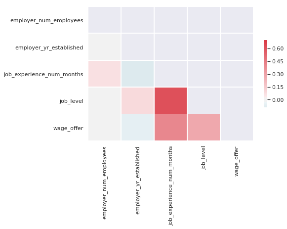

# dstools
A toolkit to help with everyday data science tasks. 

### Examples


* Seperating categorical, continuous and date features. Optionally apply type changes.
* Flag features with high correlation, low variance etc. 
* Plotting - generate distribution plots, flag skew
* Generate learning curves, threshold optimization
* Generate feature importance graphs

### Code Snippets


```python
import pandas as pd
from sys import path
path.append('../src')
from dstools.dstools import DStools as dst
```


```python
#data = pd.read_fwf('./sample_dataset/auto-mpg.data', \
#                   names=[ 'mpg','cylinders','displacement','horsepower','weight','acceleration','year','origin','name'], \
#                   na_values='?')

data =  pd.read_csv("./sample_dataset/wages_data_iso8859.csv", encoding='ISO-8859-1')
ds = dst()
```

* Data types from CSV before processing 


```python
data.dtypes
```


    case_number                   object
    case_received_date            object
    decision_date                 object
    case_status                   object
    employer_name                 object
    employer_num_employees       float64
    employer_yr_established      float64
    job_education                 object
    job_experience_num_months    float64
    job_state                     object
    job_foreign_lang_req          object
    job_level                    float64
    employee_citizenship          object
    wage_offer                   float64
    wage_unit                     object
    dtype: object


* Seperating numerical/categorical/temporal features and applying datatypes to dataframe


<br>
process_dtypes options 
<br>
 - tapply to selectively transform datatypes
<br>
 - thr acts as a threshold beyond which a feature is considered numerical
<br>
 - for example if a feature has 2000 unique categories it could be transformed to encoded to numeric


```python
features = ds.process_dtypes(data, tapply = False, thr=1000)
```

Data types from CSV after processing 
<br>
-Notice datetime and category updates to fetures


```python
data.dtypes
```


    case_number                   object
    case_received_date            object
    decision_date                 object
    case_status                   object
    employer_name                 object
    employer_num_employees       float64
    employer_yr_established      float64
    job_education                 object
    job_experience_num_months    float64
    job_state                     object
    job_foreign_lang_req          object
    job_level                    float64
    employee_citizenship          object
    wage_offer                   float64
    wage_unit                     object
    dtype: object


* process dtype returns a dictionary of features, keyed according to their type


```python
features.get('numfeatures'), features.get('numfeatures')
```


    (['employer_num_employees',
      'employer_yr_established',
      'job_experience_num_months',
      'job_level',
      'wage_offer'],
     ['employer_num_employees',
      'employer_yr_established',
      'job_experience_num_months',
      'job_level',
      'wage_offer'])


* A Quick way to find out highly correlated pairs in data,  t controls the boundry correlation threshold to filter the features
<br> and generates a sns themed plot 


```python
ds.check_correlations(data, features.get("numfeatures"), t=0.5, plot=True)
```

    job_level and job_experience_num_months = 0.61412

    [[0.6141162849461972, 3, 2]]




