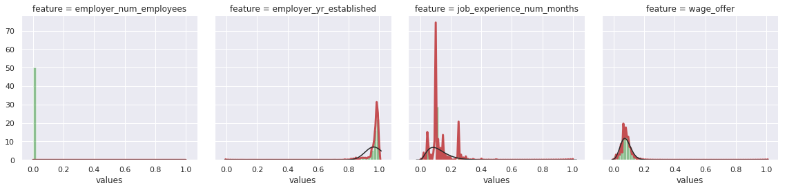

# edatools
A toolkit to help with everyday data science tasks. 

### Examples

* Seperating categorical, continuous and date features. Optionally apply type changes.
* Flag features with high correlation, low variance etc. 
* Plotting - generate distribution plots, flag skew
* Generate learning curves, threshold optimization
* Generate feature importance graphs

### Code Snippets

```python
path.append('../src')
from edatools.edatools import DStools as dst
warnings.filterwarnings("ignore")
```


```python
data = pd.read_fwf('./sample_dataset/auto-mpg.data', \
                   names=[ 'mpg','cylinders','displacement','horsepower','weight','acceleration','year','origin','name'], \
                   na_values='?')
#data =  pd.read_csv("./sample_dataset/wages_data_iso8859.csv", encoding='ISO-8859-1')
ds = dst()
```

* Data types from CSV before processing 

```python
data.dtypes
```
    mpg             float64
    cylinders         int64
    displacement    float64
    horsepower      float64
    weight          float64
    acceleration    float64
    year              int64
    origin            int64
    name             object
    dtype: object


### Seperating numerical/categorical/temporal features and applying datatypes to dataframe
<br>
process_dtypes options 
<br>
 - tapply to selectively transform datatypes
<br>
 - thr acts as a threshold beyond which a feature is considered numerical
<br>
 - for example if a feature has 2000 unique categories it could be transformed to encoded to numeric
 <br>


```python
features = ds.process_dtypes(data, tapply = True, thr=30)
```

    feature  cylinders  contains  5  unique values, converted to categorical encoding
    feature  year  contains  13  unique values, converted to categorical encoding
    feature  origin  contains  3  unique values, converted to categorical encoding
    feature  name  contains  305  unique values, converted to numeric encoding


Data types from CSV after processing 
<br>
-Notice datetime and category updates to features


```python
data.dtypes
```
    mpg              float64
    cylinders       category
    displacement     float64
    horsepower       float64
    weight           float64
    acceleration     float64
    year            category
    origin          category
    name               int16
    dtype: object


Process dtype returns a dictionary of features, keyed according to their type. 
 - skip: feature that has vary low variance, such as index columns etc
 - encode: features that do not fit well in numercal due to low number of unique values and should be encoded
 - dtfeatures: temporal features such as date 


```python
features
```


    defaultdict(list,
                {'numfeatures': ['mpg',
                  'displacement',
                  'horsepower',
                  'weight',
                  'acceleration'],
                 'catfeatures': ['cylinders', 'year', 'origin'],
                 'encode': ['name']})


### Distribution kde plots with approximated distribution

To analyze a range of continuous features at a glance, the dist_plots method can be used. It generates density plots(green) along with approximated distribution (red) for a given feature


```python
ds.dist_plots(data, features.get('numfeatures'), scale=True)
```





### Count plots, with conditional plotting 

Similarly for categorical features, count plots can be generated for a list of features (the features dictionary generated above comes in handy here). Optionally, a xhue option can be passed to generate count plots that consider another categorical feature.


```python
ds.count_plots(data, features.get('catfeatures'))
```


```python
ds.count_plots(data, features.get('catfeatures').copy(), features.get('catfeatures').copy()[0])
```


### Correlation plot with threshold based identification of highly correlated features
* A Quick way to find out highly correlated pairs in data,  t controls the boundry correlation threshold to filter the features
<br> and generates a sns themed plot 


```python
ds.check_correlations(data, features.get("numfeatures"), t=0.8, plot=True)
```

    weight and displacement = 0.93282
    horsepower and displacement = 0.89726
    weight and horsepower = 0.86454
    weight and mpg = -0.83174
    displacement and mpg = -0.80420


### Detect outliers and adjust distribution skew 

- processOutliers accepts a dataframe of with continuous feature, finds outliers based on IQR range 
- for positive/right skew log transformation is applied
- for negative/left skew exponential transformation is applied
- the function returns outliers dataframe and cleaned up dataframe


```python
cleaned_df, outliers = dst.processOutliers(data[features.get('numfeatures')], plot=True, transform=True)
```

    ____mpg____                        
    	 lower outlier bound -7.80, upper bound 54.30  :::  number of outliers 0                        
    	 skew for distribution 0.46
    ____displacement____                        
    	 lower outlier bound -242.80, upper bound 609.05  :::  number of outliers 0                        
    	 skew for distribution 0.72
    ____horsepower____                        
    	 lower outlier bound -37.20, upper bound 238.20  :::  number of outliers 6                        
    	 skew for distribution 1.09
    ____weight____                        
    	 lower outlier bound -821.60, upper bound 6653.35  :::  number of outliers 0                        
    	 skew for distribution 0.53
    ____acceleration____                        
    	 lower outlier bound 6.46, upper bound 24.54  :::  number of outliers 2                        
    	 skew for distribution 0.28
    
    Total Number of outliers: 8
    Original shape of data: (398, 5)
    New shape of data: (390, 5)
    
     Distribution plots before and Distribution plots After skew adjustment and outlier changes


