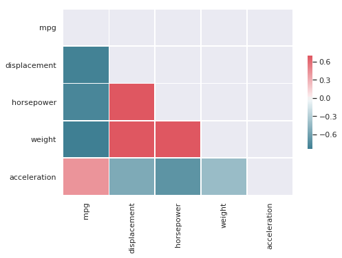

```python
from dstools.dstools import DStools as dst
```


```python
data = pd.read_fwf('./sample_dataset/auto-mpg.data', \
                   names=[ 'mpg','cylinders','displacement','horsepower','weight','acceleration','year','origin','name'], \
                   na_values='?')
#data =  pd.read_csv("./sample_dataset/wages_data_iso8859.csv", encoding='ISO-8859-1')
ds = dst()
```

* Data types from CSV before processing 

```python
data.dtypes
```
    mpg             float64
    cylinders         int64
    displacement    float64
    horsepower      float64
    weight          float64
    acceleration    float64
    year              int64
    origin            int64
    name             object
    dtype: object


* Seperating numerical/categorical/temporal features and applying datatypes to dataframe


<br>
process_dtypes options 
<br>
 - tapply to selectively transform datatypes
<br>
 - thr acts as a threshold beyond which a feature is considered numerical
<br>
 - for example if a feature has 2000 unique categories it could be transformed to encoded to numeric
 <br>


```python
features = ds.process_dtypes(data, tapply = True, thr=30)
```

    feature  cylinders  contains  5  unique values, converted to categorical encoding
    feature  year  contains  13  unique values, converted to categorical encoding
    feature  origin  contains  3  unique values, converted to categorical encoding
    feature  name  contains  305  unique values, converted to numeric encoding


* Data types from CSV after processing 
<br>
-Notice datetime and category updates to fetures


```python
data.dtypes
```

    mpg              float64
    cylinders       category
    displacement     float64
    horsepower       float64
    weight           float64
    acceleration     float64
    year            category
    origin          category
    name               int16
    dtype: object


* Process dtype returns a dictionary of features, keyed according to their type


```python
features
```

    defaultdict(list,
                {'numfeatures': ['mpg',
                  'displacement',
                  'horsepower',
                  'weight',
                  'acceleration'],
                 'catfeatures': ['cylinders', 'year', 'origin'],
                 'encoded': ['name']})


* To analyze a list of features at a glance, the dist_plots method can be used. It generates density plots(green) along with approximated distribution (red) for a given feature


```python
ds.dist_plots(data, features.get('numfeatures'), scale=True)
```


* A Quick way to find out highly correlated pairs in data,  t controls the boundry correlation threshold to filter the features
<br> and generates a sns themed plot 


```python
ds.check_correlations(data, features.get("numfeatures"), t=0.8, plot=True)
```

    weight and displacement = 0.93282
    horsepower and displacement = 0.89726
    weight and horsepower = 0.86454
    weight and mpg = -0.83174
    displacement and mpg = -0.80420


